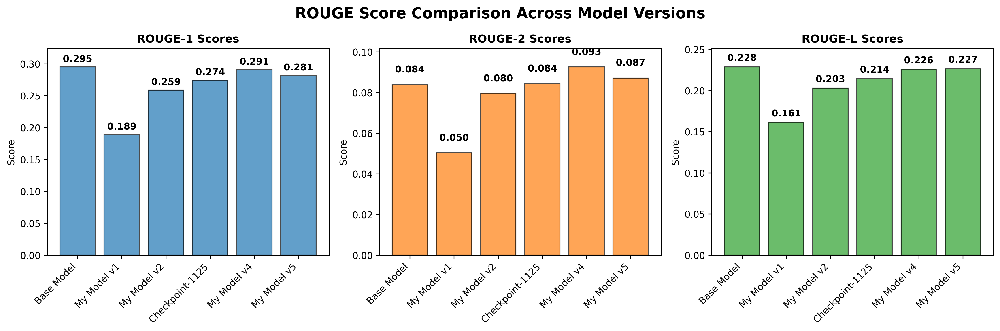

<a name="project-title--description"></a>
# 📌 Fine-Tuning Google FLAN-T5 Small on XSum for Abstractive Summarization

This project demonstrates **fine-tuning the Google FLAN-T5 Small model** on the **XSum (Extreme Summarization)** dataset to perform **abstractive text summarization**. By leveraging the capabilities of FLAN-T5, this notebook shows how to adapt a pre-trained language model to generate high-quality, concise summaries from longer texts. This is particularly useful in tasks where condensing large amounts of information into short, meaningful summaries is essential, such as news articles, reports, or research papers.

---

## 📑 Table of Contents  
- [📌 Project Title & Description](#project-title--description)  
- [📘 Introduction](#introduction)  
- [📚 Dataset](#dataset)
- [📂 File Structure](#file-structure)
- [🧠 Model Architecture](#model-architecture)  
- [✨ Features](#features)  
- [🛠️ Installation & Requirements](#installation--requirements)  
- [🚀 Usage / How to Run](#usage--how-to-run)
- [🔧 Fine-Tuning Process](#fine-tuning-process)
- [📊 Results](#results)  
- [💻 Demo](#demo)  
- [🔮 Future Improvements](#future-improvements)
- [🐛 Known Issues / Limitations](#known-issues--limitations)
- [🧩 Contribution Guidelines](#contribution-guidelines)
- [🎉 Congrats!](#congrats)
- [📖 References](#references)
- [🙌 Acknowledgement](#acknowledgement)
- [📜 License](#license)

---

<a name="introduction"></a>
## 📘 Introduction

Abstractive summarization is a Natural Language Processing (NLP) task focused on generating concise summaries that rephrase the input text in a natural and human-like manner, rather than simply extracting key sentences.

The Google FLAN-T5 model is an advanced variant of the T5 (Text-To-Text Transfer Transformer) architecture, fine-tuned with instruction-based learning to improve performance on a wide range of language tasks, including summarization.

In this project, we fine-tune FLAN-T5 Small using the XSum (Extreme Summarization) dataset, which is a collection of BBC news articles paired with single-sentence summaries. The XSum dataset is well-suited for abstractive summarization because it requires the model to understand context deeply and generate highly condensed yet meaningful outputs.

This notebook provides a step-by-step guide to preprocessing the dataset, fine-tuning the FLAN-T5 Small model, evaluating performance, and generating abstractive summaries.

---

<a name="dataset"></a>
## 📚 Dataset

The XSum (Extreme Summarization) dataset, developed by the University of Edinburgh, is a benchmark dataset widely used for abstractive text summarization. It contains 226,711 BBC news articles, each paired with a single-sentence summary that captures the core idea of the article.

**Purpose:** Designed specifically for extreme summarization where the output must be highly condensed while preserving the meaning.

**Characteristics:**

- Single-sentence summaries (highly abstractive)
- Diverse topics: politics, sports, technology, health, and more
- Ideal for training models that need to generate contextually rich yet concise summaries

We chose the XSum dataset because its abstractive nature challenges the model to go beyond extractive methods and truly generate natural language summaries.

We use the **[XSum (Extreme Summarization) dataset](https://huggingface.co/datasets/knkarthick/xsum)**, which is widely used for abstractive summarization.

### **Dataset Details:**
- **Purpose:** Generate a **single-sentence abstractive summary** of BBC news articles.
- **Size:**
  - **Train:** ~204,045 samples  
  - **Validation:** ~11,334 samples  
  - **Test:** ~11,334 samples  

Each data point includes:
- **`dialogue`** → The full news article text.
- **`summary`** → The single-sentence abstractive summary.

---

<a name="file-structure"></a>
## 📂 File Structure

📁 **adapters/**  
  ↳ Fine-tuned **LoRA adapters** (sessions 1–5)  

📁 **checkpoint_dir/**  
  ↳ Intermediate **training checkpoints**  

📁 **logs/**  
  ↳ **Training logs**  

🖼️ **rouge_comparison.png**  
  ↳ **ROUGE visualization plot**  

📄 **requirement.txt**  
  ↳ **Dependencies & requirements to install**  

📓 **Fine-Tuning Google FLAN-T5 Small on XSum for Summarization.ipynb**  
  ↳ Main **Colab notebook for fine-tuning**  

📘 **README.md**  
  ↳ **Project documentation**

---

<a name="model-architecture"></a>
## 🧠 Model Architecture

The FLAN-T5 Small model is a transformer-based encoder-decoder architecture developed by Google, adapted from the T5 (Text-to-Text Transfer Transformer) model.

**Key points about FLAN-T5 Small:**

- **Instruction Fine-Tuning:** FLAN models are trained on a variety of instruction-following tasks, making them highly versatile and effective for NLP applications.
- **Encoder-Decoder Structure:** The encoder processes the input text, and the decoder generates the summarized output.
- **Efficiency:** The Small variant is lightweight, with fewer parameters than larger versions, making it suitable for training in resource-constrained environments while still delivering strong performance on summarization tasks.

Its text-to-text design makes it ideal for summarization since both input (article) and output (summary) are text sequences.

---

<a name="features"></a>
## ✨ Features

This notebook covers:

- ✅ Loading the **XSum summarization dataset**  
- ✅ Applying **LoRA (Low-Rank Adaptation)** for parameter-efficient fine-tuning  
- ✅ Training with checkpoints for resuming later  
- ✅ Saving and logging fine-tuned models  
- ✅ Evaluating models using **ROUGE metrics**  
- ✅ Visualizing results with bar charts for comparison  
- ✅ Testing models interactively (custom text input, dataset samples)  
- ✅ The notebook includes a zip backup function (zips entire project excluding `sample_data` for download)

---

<a name="installation--requirements"></a>
## 🛠️ Installation & Requirements

This project requires **Python 3.8+** and uses libraries from Hugging Face and other popular ML/visualization packages for fine-tuning and evaluation.

### 🔧 **Environment Setup**

1. **Clone the repository (if hosted on GitHub):**

```bash
git clone https://github.com/your-username/flan-t5-xsum-summarization.git
cd flan-t5-xsum-summarization
```

2. **Create and activate a virtual environment (recommended):**

```bash
python -m venv venv
source venv/bin/activate       # For Linux/MacOS
venv\Scripts\activate          # For Windows
```

3. **Install all dependencies:**

```bash
pip install -r requirements.txt
```

---

### 📦 **Required Libraries**

This project uses the following libraries:

* **torch** – Deep learning framework for training and inference  
* **transformers** – Hugging Face library for FLAN-T5 model and tokenizers  
* **datasets** – For loading and managing the XSum dataset  
* **accelerate** – For seamless multi-GPU or TPU training  
* **peft** – Parameter-Efficient Fine-Tuning (LoRA)  
* **trl** – Training reinforcement learning models with language models  
* **rouge-score** – For evaluating summarization quality  
* **pandas, numpy** – Data handling and preprocessing  
* **matplotlib, seaborn** – Visualization of training metrics  
* **google-colab (optional)** – If using Google Colab for execution  

Alternatively, install manually:

```bash
pip install torch transformers datasets accelerate peft trl rouge-score pandas numpy matplotlib seaborn
```

---

<a name="usage--how-to-run"></a>
## 🚀 Usage / How to Run

Follow these steps to run the notebook and fine-tune **FLAN-T5 Small** on the **XSum dataset**:

1. **Clone the repository and install dependencies:**

   ```bash
   git clone https://github.com/your-username/flan-t5-xsum-summarization.git
   cd flan-t5-xsum-summarization
   pip install -r requirements.txt
   ```

2. **Open the Jupyter Notebook (or Google Colab):**

   ```bash
   jupyter notebook
   ```

   Open `Fine-Tuning Google FLAN-T5 Small on XSum for Summarization.ipynb` in Jupyter or upload it to **Google Colab**.

3. **Run cells step-by-step:**

   * Load the **XSum dataset**  
   * Preprocess and tokenize data  
   * Fine-tune the **FLAN-T5 Small model**  
   * Evaluate performance using **ROUGE metrics**  
   * Generate sample summaries  

4. **(Optional) Use Colab GPU for faster training:**

   * Change runtime to **GPU**: *Runtime > Change Runtime Type > GPU*

---

<a name="fine-tuning-process"></a>
## 🔧 Fine-Tuning Process
> ### 📝 Note  
> This notebook includes detailed explanatory markdown cells, making it **beginner-friendly** while still technically comprehensive.  
> For in-depth technical insights on fine-tuning steps, training parameters, and model evaluation, please refer to the markdown explanations within the notebook itself.

### 1️⃣ Load Base Model and Tokenizer
We use **Hugging Face Transformers** to load the base model:

```
    from transformers import AutoTokenizer, AutoModelForSeq2SeqLM

    model_name = "google/flan-t5-small"
    tokenizer = AutoTokenizer.from_pretrained(model_name)
    model = AutoModelForSeq2SeqLM.from_pretrained(model_name)
```

---

### 2️⃣ Load and Preprocess Dataset
- Load the **XSum dataset** using Hugging Face Datasets.  
- Tokenize documents (`dialogue`) and summaries (`summary`).  
- Prepare tokenized batches for training.  

---

### 3️⃣ Apply LoRA (PEFT)
We integrate **LoRA adapters** to fine-tune efficiently:

```
    from peft import LoraConfig, get_peft_model, TaskType

    peft_config = LoraConfig(
        task_type=TaskType.SEQ_2_SEQ_LM,
        inference_mode=False,
        r=8,
        lora_alpha=16,
        lora_dropout=0.1,
        target_modules=["q", "v"]
    )

    model = get_peft_model(model, peft_config)
 ```

✅ **This reduces the number of trainable parameters significantly!**

---

### 4️⃣ Training Setup
- **Batch Size:** 4  
- **Gradient Accumulation:** 2 steps  
- **Epochs:** Progressive (sessions: 3 → 6 → 9 → 12 → 15)  
- **Precision:** FP16 mixed precision for faster training  
- **Checkpoints:** Saved after each training session  

---

### 5️⃣ Resuming Training
We can resume from checkpoints to avoid restarting training from scratch:

```
    resume_from_specific_checkpoint(checkpoint_step=1125)
```

Each resumed session trains on a **new chunk of data** from the dataset.

---

### 📏 Evaluation
We evaluate models using **ROUGE metrics**, widely used for summarization tasks:
- **ROUGE-1:** Overlap of single words (unigrams)  
- **ROUGE-2:** Overlap of word pairs (bigrams)  
- **ROUGE-L:** Longest common subsequence (sequence overlap)  

📌 **Example ROUGE Scores:**

```
    ROUGE-1: 0.2951  
    ROUGE-2: 0.0839  
    ROUGE-L: 0.2285
```
> ### 🔍 For More Insights 
> While this section outlines the fine-tuning workflow, the accompanying notebook includes  
> **step-by-step code, inline outputs**, and **detailed markdown explanations** that break down each phase —  
> from data preprocessing to training and checkpointing.  
>  
> 📓 **We recommend exploring the notebook directly** to better understand the inner workings and experiment hands-on with the fine-tuning process.

---

<a name="results"></a>
## 📊 Results

The fine-tuned **FLAN-T5 Small** model was evaluated using the **ROUGE** metric, which measures the overlap between generated summaries and reference summaries. Below is the comparison of different checkpoints and versions of the model:

### 📊 **ROUGE Score Comparison Table**
We compare:
- Base model vs. fine-tuned models (Sessions **1–5**)  
- Checkpoint models during intermediate steps  

| Model Name       | ROUGE-1 | ROUGE-2 | ROUGE-L | Samples |
|------------------|---------|---------|---------|---------|
| Base Model       | 0.2951  | 0.0839  | 0.2285  | 100     |
| My Model v1      | 0.1889  | 0.0504  | 0.1612  | 100     |
| My Model v2      | 0.2589  | 0.0795  | 0.2028  | 100     |
| Checkpoint-1125  | 0.2742  | 0.0843  | 0.2143  | 100     |
| My Model v4      | 0.2906  | 0.0925  | 0.2257  | 100     |
| My Model v5      | 0.2815  | 0.0871  | 0.2265  | 100     |

### 📈 **Visual Representation (ROUGE Scores Over Time)**

The notebook also generates bar charts comparing ROUGE-1, ROUGE-2, and ROUGE-L across models.



---

### 🔹 **Sample Output Example**

**Input (Article):**  
*"The COVID-19 pandemic has fundamentally changed how we work and live. Remote work became
        the norm for millions of employees worldwide, leading to a massive shift in workplace culture.
        Many companies discovered that employees could be just as productive working from home,
        leading to permanent changes in work arrangements. The pandemic also accelerated digital
        transformation across industries, with businesses rapidly adopting new technologies to
        maintain operations and serve customers in a socially distanced world."*

**Generated Summary:**  
*"The COVID-19 pandemic has accelerated a shift in workplace culture across the world."*

---

<a name="demo"></a>
## 💻 Demo

You can try the notebook interactively on **Google Colab**:  
👉 [**Open in Google Colab**](https://colab.research.google.com/drive/1AC-O89jeTejvY8-9rrUgee2c3yl4sdlk?usp=sharing)

This demo allows users to:

* Fine-tune FLAN-T5 Small without local setup  
* Test summarization on custom text inputs  

> 💡 **Tip:**  
> You **don't need to train or fine-tune the model** if you only want to **test the outputs of the fine-tuned models**.  
> This repository already includes **training checkpoints and LoRA adapters (up to Session 5)**.  
> 
> ➡️ Simply **jump directly to "Step 12"** in the notebook to load the provided fine-tuned adapters and start generating summaries without any training!  
> 
> ⚠️ **Note:** You still need to **run all required installations and function definitions** in the earlier steps to ensure everything works correctly before jumping to Step 12.

---

<a name="future-improvements"></a>
## 🔮 Future Improvements

Planned enhancements for this project include:

* 🔧 **Hyperparameter tuning** for improved performance (e.g., learning rate, batch size)  
* 🔥 Fine-tuning larger FLAN-T5 variants (*Base, Large, XL*) for better summarization quality  
* 🗂 Exploring other summarization datasets (e.g., **CNN/DailyMail**)  
* 🧪 Implementing mixed precision training for faster and memory-efficient fine-tuning  
* 🚀 Deploying the model as a **REST API** or **web app** for real-world usage  

---

<a name="known-issues--limitations"></a>
## 🐛 Known Issues / Limitations
- Summarization quality may degrade for very long documents (>1024 tokens).
- Larger FLAN-T5 models require more compute and may not fit in free-tier GPU memory.

---

<a name="contribution-guidelines"></a>
## 🧩 Contribution Guidelines
Contributions are welcome! Please open issues or submit pull requests to improve the notebook, add new features, or optimize training.

---

<a name="congrats"></a>
## 🎉 Congrats!

If you’ve reached this point, **you’ve successfully walked through dataset preparation**, fine-tuning **FLAN-T5 with LoRA**, evaluating with **ROUGE metrics**, and visualizing results! ✨  

This project is personally built by **Shyam Kumar Khatri** and shared openly to help the community **learn and experiment with LLM fine-tuning**.  
It has been designed with **beginners in mind**, ensuring **clear explanations** and a **step-by-step approach** for better understanding.  

Feel free to **fork this repo**, tweak **hyperparameters**, explore **new datasets**, or even contribute **improvements back to the project**.  
Together, we can make **learning more accessible for everyone! 🚀**  

---

⭐ **If this project helped you**, consider giving it a **[star on GitHub](https://github.com/Shyam-Kumar-Khatri/Fine-Tuning-Google-FLAN-T5-Small-on-XSum-for-Abstractive-Summarization)** to support and share it with others in the community!  

---

<a name="references"></a>
## 📖 References

* **FLAN-T5 Paper (Google Research):**  
  *Longpre, S., Hou, L., Vu, T., et al. "Flan-T5: Scaling Instruction-Finetuned Language Models."*  
  [https://arxiv.org/abs/2210.11416](https://arxiv.org/abs/2210.11416)

* **Hugging Face Transformers Library:**  
  Hugging Face team. *"Transformers: State-of-the-art Natural Language Processing."*  
  [https://github.com/huggingface/transformers](https://github.com/huggingface/transformers)

* **Hugging Face Datasets Library:**  
  Hugging Face team. *"Datasets: Lightweight library for easily sharing and accessing datasets."*  
  [https://github.com/huggingface/datasets](https://github.com/huggingface/datasets)

* **XSum Dataset (Extreme Summarization):**  
  Narayan, S., Cohen, S.B., Lapata, M. *"Don't Give Me the Details, Just the Summary! Topic-Aware Convolutional Neural Networks for Extreme Summarization."*  
  [https://huggingface.co/datasets/xsum](https://huggingface.co/datasets/xsum)

---

<a name="acknowledgement"></a>
## 🙌 Acknowledgement

We would like to acknowledge the contributions of:

* **Hugging Face** for providing the **Transformers** and **Datasets** libraries that form the backbone of this project.  
* **Google Research Team** for their groundbreaking work on **FLAN-T5**, which made this project possible.  
* **University of Edinburgh NLP Group** for creating the **XSum dataset** used in training and evaluation.  
* **Google Colab** for offering free GPU and TPU resources, enabling efficient model training and experimentation without local hardware limitations.  
* The open-source community for their continuous support and resources that helped accelerate experimentation and development.

---

<a name="license"></a>
## 📜 License

This project is licensed under the **MIT License**.

You are free to use, modify, and distribute this project, provided that proper credit is given to the original authors.  
See the [LICENSE](LICENSE) file for more details.

---
